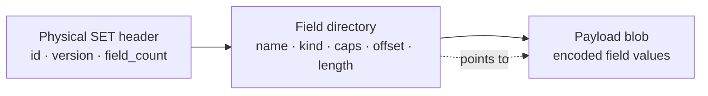
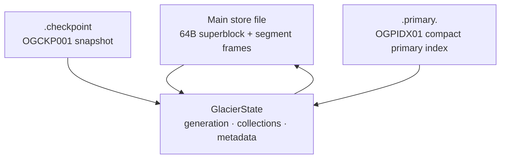
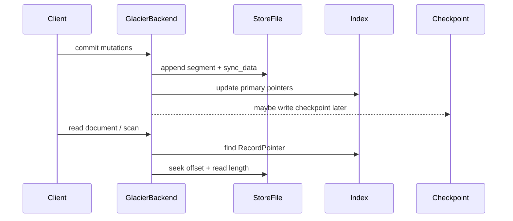

# Glacier file structure


Glacier is an append-only, record-backed storage layout. The main store file starts with a fixed superblock, then grows by appending self-contained segment frames. Sidecar files keep startup and lookup fast.

## 1. Main store file

```text
+--------------------+--------------------+--------------------+-----+
| Superblock: 64 B   | Segment frame      | Segment frame      | ... |
| magic OGGLACR\0    | magic OGSEG005     | magic OGSEG005     |     |
+--------------------+--------------------+--------------------+-----+
```

Superblock fields:

| Field | Meaning |
|---|---|
| `MAGIC = OGGLACR\0` | Identifies a Glacier store. |
| `format_version = 5` | Current on-disk format version. |
| `page_size = 16 KiB` | Declared Glacier page size. |
| `created_at_ms`, `store_id` | Store identity. |
| checksum | Validates the header bytes. |

Source: `glacier.rs` lines 28-35 and 6607-6665.

## 2. Segment frame schema

Each commit batch is encoded into one segment:

```text
+----------------+----------------------+----------------------+----------------------+
| Header: 48 B   | Directory            | Metadata delta       | Records area         |
| OGSEG005       | SegmentIndexEntry[]  | FieldCatalog diff    | SET / DELETE / CLEAR |
+----------------+----------------------+----------------------+----------------------+
```

Header fields include generation, record count, directory length, metadata length, records length, checksum for directory+metadata, and checksum for records.

The directory maps each logical mutation to a byte range in the records area:

| Directory field | Purpose |
|---|---|
| `collection` | Target collection, or none for clear. |
| `id` | Document ID. |
| `version` | Document version for SET. |
| `kind` | SET, DELETE, or CLEAR. |
| `relative_offset` | Start of payload inside records area. |
| `length` | Payload size. |

Source: `glacier.rs` lines 2842-2891 and 3437-3606.

## 3. Physical SET record schema

SET records use a more column-like physical payload:

```text
+-------------------------+-----------------------------+--------------------------+
| Physical SET header     | Field directory             | Field payloads           |
| OGDOC001, 64 B          | name/kind/caps/offset/len   | encoded ImageValue bytes |
+-------------------------+-----------------------------+--------------------------+
```

Field directory entries make projected scans efficient because each field has its own offset and length. A reader can decode only requested fields instead of the whole document.



Source: `glacier.rs` lines 3012-3091.

## 4. Sidecars and in-memory state



- `.checkpoint` stores the current generation, data length, collection documents, and field metadata.
- `.primary.<hash>` stores compact ordered entries: document ID, generation, version, record offset, and record length.
- In memory, `GlacierState` tracks generation, clear generations, per-collection indexes, and field metadata.

Source: `glacier.rs` lines 206-290, 668-705, and 5365-5492.

## 5. Write/read/recovery flow



Startup reads the superblock, loads a valid checkpoint if available, then replays segment frames from the checkpoint data length to the end of the store file.

Source: `glacier.rs` lines 1070-1179, 1547-1646, and 5946-6015.
